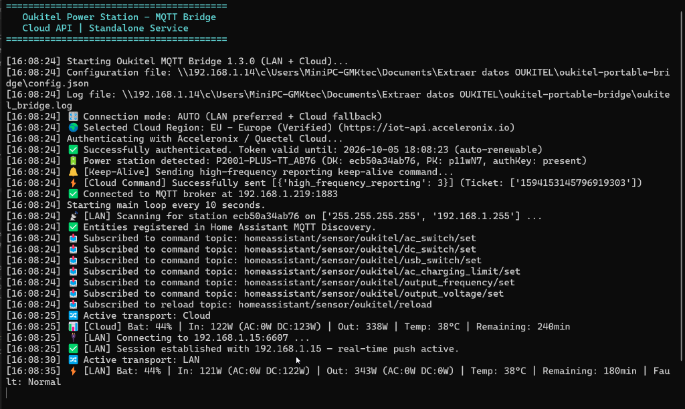

<div align="center">
  
  <h1>Oukitel Power Station - Universal Python MQTT Bridge</h1>

  <p>A standalone, ultra-lightweight, cross-platform Python bridge to connect <b>Oukitel Portable Power Stations</b> (P2001 Plus, P2001, P5000, BP2000, and compatible models) to any <b>MQTT ecosystem</b>.</p>

  [](https://github.com/VictorCV-DAM/oukitel-portable-bridge/tags)
  [](https://www.python.org/)
  [](https://github.com/VictorCV-DAM/oukitel-portable-bridge)
  [](LICENSE)
  [](https://buymeacoffee.com/VictorCV)
  [](https://paypal.me/victorcava)
  [](https://ko-fi.com/victorcv)

  <br/><br/>
  
</div>

---

## 🌐 100% Pure Python & Cross-Platform

This application **does not depend on Windows or any specific operating system**. It is written entirely in pure Python (utilizing standard libraries alongside `requests`, `pycryptodome`, and `paho-mqtt`).

You can run it virtually anywhere:
* 🐧 **Linux** (Debian, Ubuntu, Alpine, Arch, etc.)
* 🍓 **Raspberry Pi / Single Board Computers** (DietPi, Raspberry Pi OS)
* 🍏 **macOS**
* 🪟 **Windows** (Native or Service)
* 🐳 **Docker / Podman containers**

---

## 📡 Universal MQTT Architecture

While this project includes automatic **Home Assistant MQTT Discovery** as a convenient example and out-of-the-box integration, it publishes clean, standardized MQTT topics and listens for standard MQTT commands. 

It is completely agnostic and easily integrates into:
* **Node-RED** flows for custom solar energy automation.
* **openHAB** / **Domoticz** / **ioBroker** / **HomeSeer**.
* **InfluxDB + Telegraf + Grafana** for advanced long-term battery cycle analytics.
* **Custom Python / Go / Rust scripts or IoT dashboards**.

### Published Topics & Payload Overview
* **Battery & Power Balance:**
  - `homeassistant/sensor/oukitel/battery`: State of charge percentage (%).
  - `homeassistant/sensor/oukitel/input_watts` / `output_watts`: Real-time total power (W).
  - `homeassistant/sensor/oukitel/ac_input_watts` / `dc_input_watts`: Grid & MPPT solar charging wattage (W).
  - `homeassistant/sensor/oukitel/remain_time`: True battery autonomy countdown while net discharging (min).
  - `homeassistant/sensor/oukitel/remain_charging_time`: Dynamic estimate to reach 100% full capacity (min).
  - `homeassistant/sensor/oukitel/remaining_time`: Station LCD display equivalent time (min).
* **Individual Port Telemetry (Zero "Unknown" States):**
  - `homeassistant/sensor/oukitel/ac_output_power` / `ac_output_voltage`: 230V inverter wattage and voltage.
  - `homeassistant/sensor/oukitel/typec1_power` through `typec4_power`: Dedicated wattage for all 4 USB Type-C ports.
  - `homeassistant/sensor/oukitel/usb_a_power` / `usb_c_qc_power`: USB-A and Quick Charge port wattages.
  - `homeassistant/sensor/oukitel/dc_output_power`, `dc_output_voltage`, `dc_output_current`: 12V car socket metrics.
* **Health & Fault Alarms:**
  - `homeassistant/sensor/oukitel/hardware_fault_status`: Standardized ENUM sensor (`Normal`, `High Temperature Warning`, `Over-Temperature`, `Under-Temperature`, `Low Battery Warning`, `Critical Low Battery`, `Overload Protection`, `Hardware Fault`).
  - `homeassistant/sensor/oukitel/hardware_fault_status/attributes`: JSON attributes including `fault_details` and `possible_states`.
* **Remote Switches & Settings:**
  - `homeassistant/switch/oukitel/ac_switch`, `dc_switch`, `usb_switch`: Toggle outputs (`ON`/`OFF`).
  - `homeassistant/number/oukitel_ac_charging_limit`: AC upper charge rate limit (3% to 100%).
  - `homeassistant/select/oukitel_output_frequency` / `oukitel_output_voltage`: Inverter frequency and voltage settings.
  - `homeassistant/button/oukitel_reload`: Trigger instant session reload and discovery update.

<p align="center">
  
</p>

---

## ✨ Key Features & Advantages

1. **Dual Transport Architecture**: Connects directly via **Local LAN (TCP 6607, AES-128)** for sub-second push updates, falling back seamlessly to Cloud polling if off-site.
2. **Individual Port Breakdown**: Discrete wattage monitoring for every Type-C, USB, DC, and AC outlet.
3. **Physics-Based Autonomy Engine**: Calculates true net energy balance (`net_power = total_input - total_output`), eliminating firmware display glitches and 99-hour LCD overflows.
4. **Native Fault Alarms**: Ready-to-use ENUM states in Home Assistant for one-click automation rules (thermal warnings, overload shedding, low battery protection).
5. **Zero Smartphone / Zero Android Emulator**: No Nox, Bluestacks, or phones running 24/7. Fully autonomous daemon.
6. **Tiny Footprint (~30 MB RAM)**: Ultra-lightweight and battery-friendly.
7. **Keep-Alive Heartbeat**: Prevents the battery station's Wi-Fi module from entering silent sleep mode.
8. **Multi-Region Cloud Coverage**:
   - `EU` (Europe — Verified & fully supported)
   - `US` (North America — Experimental)
   - `CN` (China/Asia — Experimental)

---

## ⚙️ Quick Start Guide

### 1. Requirements
Ensure you have **Python 3.9 or newer** installed.
```bash
python --version
```

### 2. Clone and Install Dependencies
```bash
git clone https://github.com/VictorCV-DAM/oukitel-portable-bridge.git
cd oukitel-portable-bridge
pip install -r requirements.txt
```

### 3. Configure Credentials
Copy `config.example.json` to `config.json`:
```bash
# On Linux/macOS
cp config.example.json config.json

# On Windows
copy config.example.json config.json
```

Edit `config.json` with your settings:
```json
{
  "cloud": {
    "region": "EU",
    "email": "your_wonderfree_app_email@example.com",
    "password": "your_app_password"
  },
  "mqtt": {
    "broker": "192.168.1.50",
    "port": 1883,
    "user": "mqtt_user",
    "password": "mqtt_password",
    "topic_base": "homeassistant/sensor/oukitel"
  },
  "polling": {
    "interval_seconds": 10,
    "wake_interval_seconds": 25
  }
}
```

### 4. Run the Bridge

#### Cross-Platform (Linux, macOS, Windows, Raspberry Pi)
```bash
python3 oukitel_cloud_mqtt.py
```

#### Windows Convenience Launchers & Desktop Shortcut
For Windows users, ready-to-use launch scripts and desktop shortcuts are provided:
* **`Oukitel MQTT Bridge.lnk`**: Pre-configured desktop/folder shortcut featuring the official Oukitel station icon.
* **`create_shortcut.ps1`**: Helper script that automatically creates or updates the desktop shortcut with `icon.ico`.
* **`start_bridge.bat`**: Double-clickable batch file with automated environment checks.
* **`start_bridge.ps1`**: PowerShell script that dynamically assigns the custom Oukitel icon to the console window and taskbar.

#### Linux Systemd Service (Optional, for 24/7 background operation)
Create `/etc/systemd/system/oukitel-bridge.service`:
```ini
[Unit]
Description=Oukitel Power Station MQTT Bridge
After=network.target

[Service]
Type=simple
User=your_user
WorkingDirectory=/opt/oukitel-portable-bridge
ExecStart=/usr/bin/python3 /opt/oukitel-portable-bridge/oukitel_cloud_mqtt.py
Restart=always
RestartSec=10

[Install]
WantedBy=multi-user.target
```
Enable and start the service:
```bash
sudo systemctl daemon-reload
sudo systemctl enable --now oukitel-bridge
```

---

## ☕ Support & Donations

If this bridge has saved you hardware costs, eliminated bulky emulators, or helped automate your solar storage setup, consider supporting ongoing development:

* ☕ **Buy Me a Coffee:** [buymeacoffee.com/VictorCV](https://buymeacoffee.com/VictorCV)
* 🅿️ **PayPal:** [paypal.me/victorcava](https://paypal.me/victorcava)
* 🔴 **Ko-fi:** [ko-fi.com/victorcv](https://ko-fi.com/victorcv)
* 💖 **GitHub Sponsors:** [github.com/sponsors/VictorCV-DAM](https://github.com/sponsors/VictorCV-DAM)

---

## 👨‍💻 Author & Intellectual Property

* **Author & Maintainer:** Víctor C. V. ([@VictorCV-DAM](https://github.com/VictorCV-DAM))
* **Email:** `victorcvtrabajo@gmail.com`
* **Copyright:** © 2024-2026 Víctor C. V. All rights reserved.
* **License:** [Free for Personal Use — All Rights Reserved](LICENSE).

> [!NOTE]
> **Free for Personal Use:** Any user is granted full, free permission to install, run, and use this bridge without restrictions for personal, non-commercial purposes. Redistribution, modification, or commercial exploitation is strictly prohibited without prior written consent.

---

## ⚖️ Disclaimer

This project is an independent community development and is not affiliated with, sponsored by, or endorsed by Oukitel or Quectel/Acceleronix. All product names, logos, and brands belong to their respective owners.

